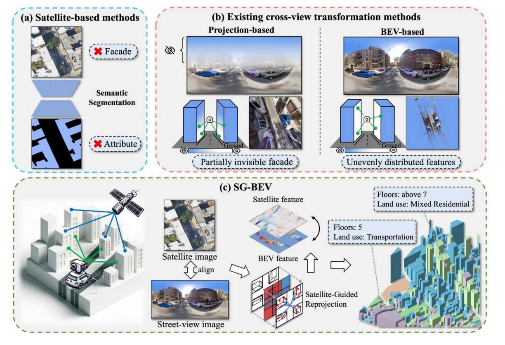

# SG-BEV: Satellite-Guided BEV Fusion for Cross-View Semantic Segmentation
This paper aims at achieving fine-grained building attribute segmentation in a cross-view scenario, i.e., using satellite and street-view image pairs. The main challenge lies in overcoming the significant perspective differences between street views and satellite views. In this work, we introduce SG-BEV, a novel approach for satellite-guided BEV fusion for cross-view semantic segmentation. To overcome the limitations of existing cross-view projection methods in capturing the complete building facade features, we innovatively incorporate Bird's Eye View (BEV) method to establish a spatially explicit mapping of street-view features. Moreover, we fully leverage the advantages of multiple perspectives by introducing a novel satellite-guided reprojection module, optimizing the uneven feature distribution issues associated with traditional BEV methods. Our method demonstrates significant improvements on four cross-view datasets collected from multiple cities, including New York, San Francisco, and Boston. On average across these datasets, our method achieves an increase in mIOU by 10.13% and 5.21% compared with the state-of-the-art satellite-based and cross-view methods.




### Installation
```bash
#### To create conda env:
    conda create -n SG-BEV python=3.8
    conda activate SG-BEV
    cd /path/to/SG-BEV
    pip install -r requirements.txt
```

# Data preparation

The Brooklyn dataset can be downloaded from "https://opendatalab.com/CVeRS/Cross-view"
